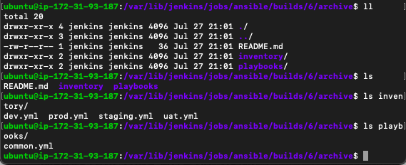
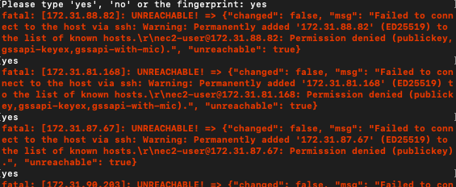

# Project 11 - Ansible Configuration Management

**Step 1 - Install & Configure Ansible**
---

- Spin up a new Ubuntu instance or use the same one with Jenkins installed. Note that if a new ansible server is to be spinned up it needs to have an elastic IP for convenience.

- Install Ansible by running `sudo apt install ansible`. Confirm Ansible is running by doing `ansible --version`.

**Step 2 - Configure Jenkins Build Job**
---

- Create a new repo in GitHub. This will be used to house the info for the project.

- Create a new project in Jenkins and point it to the newly created repo in GitHub.

- Configure webhook in GitHub and set it up to automatically trigger a new build for the project.

- Configure a post build job to save all files to the Jenkins server.

- Test setup by making a change in the master branch of the GitHub repo to see if a build is triggered automtically.

*Screenshots for step 1.1 are available in Proj 9 for guidance on how to configure Jenkins build*

- Clone down the repo to the local machine.

**Step 3 - Set Up SSH Agent**
---

- Enable port 22 is opened on the Ansible/Jenkins server.

- Run the following commands on your terminal to set up the SSH agent.

```
eval `ssh-agent -s`
ssh-add <path-to-private-key>
```

- Run `ssh-add -l` to confirm if the key has been successfully added.

- Try to connect to the Ansible/Jenkins instance by running `ssh -A ubuntu@public-ip`. Note that for EC2 based instances it is `ec2-user@public-ip`.

**Step 4 - Set Up Ansible Inventory**
---

- Create a new branch in your local computer, which will be used for development of new features as deployment directly to the main/master branch is NOT recommended. Best practice is to give descriptions to every new branch created.

- Create two directories named `playbooks` for storing playbook files & `inventory` to keep hosts organized.

- Within the `playbooks` folder, create an ansible playbook and name it `common.yml`.

- Within the `inventory` folder, create an inventory file for each environment and name them `dev.yml`, `staging.yml`, `uat.yml` & `prod.yml`.



- Update the `inventory/dev.yml` file with the code below. This is to declare all the host files ansible would use.

```
[nfs]
<NFS-Server-Private-IP-Address> ansible_ssh_user='ec2-user'

[webservers]
<Web-Server1-Private-IP-Address> ansible_ssh_user='ec2-user'
<Web-Server2-Private-IP-Address> ansible_ssh_user='ec2-user'
<Web-ServerX-Private-IP-Address> ansible_ssh_user='ec2-user'

[db]
<Database-Private-IP-Address> ansible_ssh_user='ec2-user' 

[lb]
<Load-Balancer-Private-IP-Address> ansible_ssh_user='ubuntu'
```

**Step 5 - Create Playbook**
---

- Update the `playbooks/common.yml` file which contains the tasks Ansible will run on the servers in the host file

```
---
- name: update web & nfs servers
  hosts: webserver, nfs
  remote_user: ec2-user
  become: yes
  become_user: root
  tasks:
    - name: ensure wireshark is at the latest version
      yum:
        name: wireshark
        state: latest

- name: update LB & db server
  hosts: lb, db
  remote_user: ubuntu
  become: yes
  become_user: root
  tasks:
    - name: Update apt repo
      apt: 
        update_cache: yes


    - name: ensure wireshark is at the latest version
      apt:
        name: wireshark
        state: latest
```

**Step 6 - Update Git With The Latest Code**
---

- Since all the config that was done in the previous step are still on the local PC, we need to push to the dev branch in GitHub so another developer can review the code.

- After the code has been pushed, create a pull request so the code can be reviewed.

- After the code has been reviewed, merge the code into the main/master branch. Doing so will cause Jenkins to run a build via webhook since it was set up to respond to the main/master branch.

- On your local PC,checkout into the master branch and pull down the latest changes. Jenkins saves all the files to the `/var/lib/jenkins/jobs/ansible/builds/<build_number>/archive/` directory on the Jenkins/Ansible server.


**Step 7 - Run Ansible Test**
---

- Change directory into the `/var/lib/jenkins/jobs/ansible/builds/<build_number>/archive/` on the Jenkins/Ansible server and run `ansible-playbook -i inventory/dev.yml playbooks/common.yml`


  - Had an error where the hosts were unreachable. I was able to resolve this issue by turning on the respective servers, ensuring their services were running ad double-checking the SSH-agent had the pem key in it.

    

  - Ran into another error called `OSError Errno12, Cannot allocate memory`. Found out that this error occurs when the machine running playbook doesn't have enough RAM to perform the action. I resolved the error by setting up swap memory on the Jenkins server.

    
    
    *Pasted `/swapfile swap swap defaults 0 0` inside the `fstab` file* 

    

- Check if wireshark was successfully installed by running `wireshark --version`


**Step 8 - Update Ansible Playbook**
---

- Now that it's confirmed the setup is working, update the ansible playbook to create a directory, a file and set the timezone. See config below.

```
- name: create directory, file and set timezone on all servers
  hosts: webserver, nfs, db, lb
  become: yes
  tasks:
    - name: create a directory
      file:
        path: /home/testdir
        state: directory

    - name: create a file
      file:
        path: /home/testdir/testdoc.txt
        state: touch

    - name: set timezone
      timezone:
        name: Africa/Lagos
```

- Run the `inventory/dev.yml` & `playbooks/common.yml` playbooks.


- Confirm if the file/folder is created and check the timezone.


**Project 11 Deployed Successfully!**
